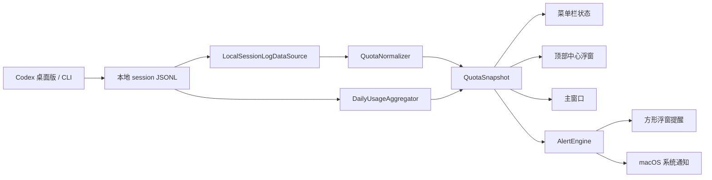

# Codex Quota Notch 设计规格

状态：已获用户确认

日期：2026-08-17

## 1. 产品目标

Codex Quota Notch 是一个 macOS 菜单栏应用，用于在本机实时显示 Codex 的七天周额度，并在额度变化、接近重置、重置或用尽时提醒用户。

首版目标平台为 macOS 13 Ventura 及以上。应用同时支持 Codex macOS 桌面应用与 Codex CLI，只读取本机 Codex 会话记录，不依赖用户复制 API 密钥，也不上传 prompt、会话内容或 token 明细。

应用默认随 macOS 登录启动，平时驻留菜单栏；用户可以打开普通主窗口查看总览、设置和历史信息。默认的即时展示方式是鼠标移动到当前屏幕水平中心的顶部区域时，显示刘海下方的方形圆角浮窗。没有刘海的屏幕仍使用相同的顶部中心位置。

## 2. 已确认的产品决策

- 项目名称：Codex Quota Notch。
- GitHub 仓库名：`codex-quota-notch`。
- 开源许可证：MIT。
- 支持系统：macOS 13 Ventura 及以上。
- 界面语言：中文与英文，根据 macOS 系统语言切换。
- 数据来源：本机 Codex 桌面版与 CLI 的会话数据。
- 数据范围：以七天窗口为主；选择 `window_minutes = 10080` 的限额作为周额度。短时限额可作为附加信息显示，但不参与周额度提醒。
- 提醒通道：顶部方形浮窗与 macOS 系统通知同时启用，且可以分别关闭。
- 默认展示模式：顶部弹窗模式。
- 可选展示模式：顶部常驻、自由拖动/缩放的方形圆角浮窗。
- 默认外观：跟随 macOS 深浅色外观；也可以手动固定浅色或深色。
- 默认开机启动：开启。

## 3. 总体架构

应用采用原生 SwiftUI + AppKit 实现。

SwiftUI 负责主窗口、设置页、总览卡片、统计视图和本地化文本；AppKit 负责菜单栏状态项、顶部中心悬停区域、非激活式浮窗、自由浮窗、窗口位置/尺寸和屏幕坐标处理。

核心模块如下：

| 模块 | 职责 |
| --- | --- |
| `CodexDataSource` | 定义本地数据源协议，屏蔽文件格式细节 |
| `LocalSessionLogDataSource` | 扫描并读取 `~/.codex/sessions` 下的 JSONL，兼容桌面版与 CLI |
| `QuotaNormalizer` | 提取七天额度、重置时间、短时额度和数据状态，输出统一快照 |
| `DailyUsageAggregator` | 根据本地会话记录计算当天与最近七天 token 量，避免重复累计 |
| `QuotaMonitor` | 监听会话文件变化，做即时更新和低频兜底刷新 |
| `AlertEngine` | 根据额度周期、阈值、时间窗口和持久化状态决定是否提醒 |
| `PresentationCoordinator` | 同步控制菜单栏、顶部浮窗、自由浮窗和主窗口 |
| `NotificationClient` | 请求并发送 macOS 系统通知 |
| `SettingsStore` | 保存外观、展示模式、提醒开关、阈值和窗口状态 |
| `Localization` | 管理中文与英文文本，根据系统语言选择资源 |

数据流：

## 4. 本地数据读取与口径

### 4.1 数据路径

默认读取当前用户的 `~/.codex/sessions` 目录，并递归扫描其中的 JSONL 文件。设置页允许用户选择其他本地数据目录，以兼容自定义 Codex 安装或未来目录变化。

应用只读文件，不修改 Codex 数据。首版采用面向 GitHub 直接分发的本地应用形态，以便默认读取 `~/.codex/sessions`；用户选择自定义目录时仍使用只读访问。

### 4.2 周额度选择

解析 `event_msg` 事件中的 `payload.rate_limits`：

1. 收集 `primary` 与 `secondary` 可用限额。
2. 优先选择 `window_minutes == 10080` 的条目作为七天周额度。
3. 如果没有七天条目，周额度显示为不可用，不将其他窗口误标为周额度。
4. `used_percent` 表示已使用比例，界面计算并显示剩余比例：

   `remainingPercent = clamp(100 - usedPercent, 0, 100)`。

   对外显示取整数，采用向下取整；例如剩余 89.9% 显示 89%。

5. `resets_at` 用于倒计时和重置周期识别。

本地记录不一定提供七天窗口的绝对 token 上限。因此界面保证显示真实的百分比、重置时间和每日 token 数；无法可靠换算时不编造“本周总 token 上限”。

### 4.3 每日 token 量

对 `event_msg` 中 `payload.type == token_count` 的事件按时间顺序处理：

1. 优先使用 `payload.info.total_token_usage.total_tokens` 的累计值。
2. 对同一会话只累计连续快照之间的正向差值，忽略重复快照和累计值回退。
3. 每个正向差值按事件时间转换到本机时区的日期。
4. 如果累计值不存在，使用 `last_token_usage.total_tokens` 作为回退，并通过事件时间与已处理快照避免重复计数。
5. 如果 `total_tokens` 不存在，按已提供的 input、cached input、cache write、output、reasoning 字段相加。

今日 token 量标注为“根据本机 Codex 会话记录统计”，不声称等于账户侧最终计费数据。

### 4.4 更新策略

- 监听会话目录与最新文件的变化，文件出现新内容后立即重新解析相关文件。
- 进程启动时做一次完整扫描。
- 文件监听没有收到事件时，每 10 秒做一次低频兜底检查。
- 顶部浮窗打开时，兜底检查提高到每 2 秒；关闭后恢复 10 秒。
- 保留最近一次有效快照和最后更新时间；快照不包含 prompt 或会话正文。

## 5. 提醒状态机

### 5.1 百分比提醒

额度提醒以剩余比例为准。默认规则：

- 剩余 90%、80%、70%、60%、50%、40%、30%、20% 各提醒一次；
- 剩余 10% 至 1% 每个整数百分点各提醒一次；
- 剩余 0% 使用“额度已用尽”专用提醒，不再额外发送普通 0% 百分比提醒。

触发条件为显示整数从阈值以上下降到阈值或更低。每个阈值在同一个周额度周期内最多提醒一次。

如果应用停止期间额度从 100% 直接变为 78%，应用启动后只提醒当前最新已达到的普通阈值，不补发 90% 与 80% 的历史弹窗。

### 5.2 重置倒计时提醒

根据 `resets_at` 与本机当前时间计算剩余时间，在进入以下窗口时各提醒一次：

| 窗口 | 中文文案 | 英文文案 |
| --- | --- | --- |
| 剩余不超过 48 小时 | 距离 Codex 周额度重置只剩下 2 天 | Only 2 days left until the Codex weekly quota resets |
| 剩余不超过 24 小时 | 距离 Codex 周额度重置只剩下一天 | Only 1 day left until the Codex weekly quota resets |
| 剩余不超过 5 小时 | 距离 Codex 周额度将在 5 小时后重置 | The Codex weekly quota resets in 5 hours |

如果应用在窗口开始后才启动，立即补发当前优先级最高的一条倒计时提醒，不补发已经越过的较早窗口。

### 5.3 重置与用尽

- 当检测到新的 `resets_at` 周期 ID 时，生成“Codex 周额度已重置”提醒，并清空上一周期的百分比与倒计时提醒状态。
- 如果重置时间已过但 Codex 尚未写入新周期，不自动将额度设为 100%，而是显示“等待下一次 Codex 数据更新”。
- 当剩余比例达到 0% 或本地状态明确标记额度用尽时，生成“Codex 周额度已用尽”提醒，每个周期一次。

### 5.4 去重、优先级与持久化

提醒去重键为：

`cycleID + alertType + threshold`

状态保存在应用自己的 Application Support 目录中，只保存阈值键、周期 ID 和时间，不保存会话内容。

同时满足多个提醒条件时，优先级为：

1. 额度已用尽；
2. 周额度已重置；
3. 剩余 5 小时；
4. 剩余 1 天；
5. 剩余 2 天；
6. 百分比提醒。

其余提醒可以排队，在短暂间隔后展示，但不会重复发送同一个去重键。

### 5.5 设置项

默认值如下，所有项均可在主窗口中调整：

- 百分比提醒：开启；普通步进 10%；
- 低额度提醒：开启；起点 10%；步进 1%；
- 重置倒计时提醒：开启；48 小时、24 小时、5 小时；
- “已重置”和“已用尽”提醒：开启；
- 顶部浮窗提醒：开启；
- macOS 系统通知：开启。

用户关闭某个提醒通道时，另一个通道仍按自己的开关继续工作。

## 6. 用户界面与展示模式

### 6.1 菜单栏

菜单栏状态项显示当前周额度剩余比例，例如 `72%` 或 `Codex 72%`。状态颜色：

- 正常：绿色/青绿色；
- 剩余较低：琥珀色；
- 剩余 10% 以内：红色；
- 数据不可用：`—`。

点击菜单栏状态项打开主窗口，并提供快速刷新、展示模式入口、通知开关和退出应用。

### 6.2 默认顶部弹窗

顶部中心方形圆角浮窗显示：

- Codex Weekly Quota / Codex 周额度；
- 大号剩余比例；
- 额度进度条；
- 下次重置日期与时间；
- 距离重置倒计时；
- 今日 token 总量；
- 数据来源状态与最后更新时间；
- 可用时的短时限额附加信息。

鼠标进入当前屏幕顶部中心触发区域后显示。默认触发区域位于屏幕水平中心、顶部约 36pt 的范围；离开触发区和浮窗后短暂延迟自动隐藏。顶部中心没有刘海时仍使用同一坐标区域。

### 6.3 顶部常驻

浮窗固定在当前屏幕水平中心的顶部，不需要悬停，不自动隐藏。内容与默认顶部弹窗相同。

### 6.4 自由浮窗

自由浮窗是方形圆角的非激活式窗口，支持：

- 拖动位置；
- 调整宽度和高度；
- 记忆位置与尺寸；
- 恢复默认位置与尺寸；
- 仍可通过菜单栏和主窗口控制。

自由浮窗不强制贴在刘海或屏幕顶部，默认位置仍为当前屏幕顶部中心附近。

### 6.5 主窗口

主窗口包含四个区域：

1. 总览：周额度卡片、重置倒计时、今日 token、最近七天 token 统计、最后更新时间。
2. 提醒：各类提醒、阈值、浮窗通道和系统通知通道的开关。
3. 外观与展示：跟随系统/浅色/深色，顶部弹窗/顶部常驻/自由浮窗，自动启动和浮窗位置/尺寸设置。
4. 数据与隐私：读取路径、数据源状态、重新扫描、模拟数据开关、隐私说明。

### 6.6 外观与本地化

默认外观跟随 macOS 深浅色模式；主窗口允许固定浅色或深色。所有颜色、图标和进度状态在两种外观下都保持可读性。

首版提供简体中文与英文本地化，系统语言为中文时使用中文，否则使用英文。用户提供的中文倒计时、重置和用尽文案作为中文默认文案。

## 7. 系统集成、权限与隐私

- 应用默认作为菜单栏辅助型应用运行，后台不显示 Dock 图标；打开主窗口时临时激活。
- 使用 macOS 13 的 `SMAppService` 注册登录启动，默认开启，可在设置关闭。
- 首次运行请求 macOS 通知权限；拒绝后浮窗仍然可用，设置页提供重新打开系统设置的入口。
- 鼠标悬停检测采用系统事件监听。若系统环境不允许全局鼠标事件，保留菜单栏点击和系统通知，并显示降级状态。
- 不申请网络权限，不连接外部服务器，不读取账号密钥，不上传任何 Codex 数据。
- 只读会话目录；解析器只保留额度字段、token 统计和时间戳，不保存 prompt、回复正文或工具调用内容。
- 分发目标是 GitHub 直接下载的 macOS 应用，而非 Mac App Store。README 明确说明本地数据访问范围和直接分发形态。

## 8. 容错与状态展示

| 情况 | UI 行为 |
| --- | --- |
| 找不到会话文件 | 显示“等待 Codex 会话数据” |
| 周额度字段缺失 | 周额度显示 `—`，仍显示可计算的每日 token |
| 部分 JSONL 损坏 | 跳过损坏行，保留其他有效数据 |
| 数据长时间未更新 | 显示最近真实数据，同时标记“数据已过期”与最后更新时间 |
| 重置时间已过但没有新周期 | 显示“等待下一次 Codex 数据更新”，不猜测为 100% |
| 通知权限关闭 | 浮窗继续工作，设置页显示系统通知状态 |
| 悬停检测不可用 | 菜单栏点击、主窗口和系统通知继续工作 |
| 用户选定目录不可读 | 显示路径错误与重新选择目录按钮 |

## 9. 测试与验收标准

### 9.1 自动化测试

- 解析桌面版/CLI 会话样本；
- 处理字段缺失、字段顺序变化和损坏 JSONL；
- 多个窗口存在时只选择 `window_minutes = 10080`；
- 每日 token 统计覆盖跨天、重复快照、多个会话和累计值回退；
- 额度剩余 90% 至 20% 的 10% 步进提醒；
- 10% 至 1% 的逐 1% 提醒和 0% 用尽提醒；
- 48 小时、24 小时、5 小时倒计时提醒；
- 重置、用尽、重启补提醒与去重；
- 模拟时间从 100% 跳到 78% 时只提示最新状态；
- 用户调整阈值与关闭通道后，AlertEngine 按设置工作。

### 9.2 手动验收

- 刘海 MacBook 内置屏幕的顶部中心悬停；
- 无刘海屏幕与外接显示器的顶部中心悬停；
- 菜单栏实时数字和颜色状态；
- 深色、浅色和跟随系统切换；
- 顶部弹窗自动隐藏；
- 顶部常驻模式；
- 自由浮窗拖动、缩放、重启后恢复位置；
- 主窗口四个区域的设置保存；
- 系统通知允许、拒绝和关闭后的降级；
- 登录启动开关；
- 没有数据、数据过期、周额度字段缺失和新周期等待状态。

### 9.3 构建验收

- macOS 13 Ventura 及以上构建成功；
- Debug 与 Release 构建成功；
- 测试通过；
- 尽量提供 arm64 与 x86_64 通用构建；
- 仓库不包含真实 Codex 会话、token 或登录信息。

## 10. GitHub 开源交付

公共仓库为 `codex-quota-notch`，包含：

- 原生 macOS 应用源码；
- MIT `LICENSE`；
- 中英文 README；
- 安装、构建、测试和权限说明；
- 数据来源、隐私边界和已知限制；
- 脱敏 JSONL 测试 fixture；
- GitHub Actions 的构建与测试工作流（若运行环境提供 Xcode）。

README 必须明确说明：本项目读取 Codex 本地会话记录，依赖 Codex 内部本地格式；如果未来格式变化导致字段无法读取，应用会显示不可用状态，而不会猜测额度。真实用户的 `.codex`、日志、API 密钥和会话正文不得提交到仓库。
